# Architecture Documentation — Corrective & Adaptive RAG Agent

> **Last Updated:** February 2026

---

## Table of Contents

1. [Full Agent Orchestration](#1-full-agent-orchestration)
2. [Full Application Flow](#2-full-application-flow)
3. [Technologies Used Per Step](#3-technologies-used-per-step)
4. [Alternatives to Chosen Technologies](#4-alternatives-to-chosen-technologies)
5. [Why We Chose These Technologies](#5-why-we-chose-these-technologies)
6. [Recommendations for Improvement](#6-recommendations-for-improvement)

---

## 1. Full Agent Orchestration

The agent is built as a **LangGraph state machine** with 8 nodes and 3 conditional routing edges. Each node is a pure function that reads from and writes to a shared `RAGState` (a `TypedDict` with 12 fields). The graph is compiled into an executable workflow via `app.invoke()`. When called from the FastAPI layer, the synchronous invocation is offloaded to a thread via `async_query_rag_agent()` (using `asyncio.to_thread()`) to keep the event loop responsive.

### Orchestration Diagram

```mermaid
graph TB
    START(("🟢 START"))
    CHECK_CACHE["💾 Check Cache<br/><i>SemanticCache</i>"]
    REWRITE["🔄 Rewrite Query<br/><i>QueryRewriter</i>"]
    RETRIEVE["📥 Retrieve Documents<br/><i>AdvancedRetriever + ChromaDB</i>"]
    GRADE["⚖️ Grade Relevance<br/><i>RelevanceGrader</i>"]
    WEB_SEARCH["🌐 Web Search<br/><i>Tavily API</i>"]
    GENERATE["✍️ Generate Answer<br/><i>Ollama LLM</i>"]
    HALLUCINATION["🔍 Hallucination Check<br/><i>HallucinationChecker</i>"]
    VERIFY["✅ Verify Answer<br/><i>AnswerVerifier</i>"]
    INCREMENT["🔢 Increment Iteration"]
    FINISH(("🔴 END"))

    START --> CHECK_CACHE
    CHECK_CACHE -- "Cache Hit" --> FINISH
    CHECK_CACHE -- "Cache Miss" --> REWRITE

    REWRITE --> RETRIEVE
    RETRIEVE --> GRADE

    GRADE -- "Relevant docs found" --> GENERATE
    GRADE -- "No relevant docs" --> WEB_SEARCH

    WEB_SEARCH --> GENERATE
    GENERATE --> HALLUCINATION

    HALLUCINATION -- "Grounded ✅" --> VERIFY
    HALLUCINATION -- "Hallucinated ❌<br/>& iterations < max" --> INCREMENT

    VERIFY -- "Good answer ✅" --> FINISH
    VERIFY -- "Needs improvement ❌<br/>& iterations < max" --> INCREMENT

    INCREMENT --> REWRITE

    style START fill:#22c55e,color:#fff
    style FINISH fill:#ef4444,color:#fff
    style CHECK_CACHE fill:#8b5cf6,color:#fff
    style REWRITE fill:#3b82f6,color:#fff
    style RETRIEVE fill:#8b5cf6,color:#fff
    style GRADE fill:#f59e0b,color:#fff
    style WEB_SEARCH fill:#06b6d4,color:#fff
    style GENERATE fill:#ec4899,color:#fff
    style HALLUCINATION fill:#f97316,color:#fff
    style VERIFY fill:#10b981,color:#fff
    style INCREMENT fill:#6b7280,color:#fff
```



### Node Descriptions

| Node | File | Purpose |
|------|------|---------|
| **Check Cache** | `nodes.check_cache` | Checks for existing semantic matches to bypass generation |
| **Rewrite** | `nodes.rewrite_query` | Reformulates the user's question for better semantic retrieval |
| **Retrieve** | `nodes.retrieve_documents` | Fetches top-k documents from ChromaDB via similarity search |
| **Grade** | `nodes.grade_documents` | LLM-based binary relevance scoring of each retrieved document |
| **Web Search** | `nodes.web_search` | Falls back to Tavily web search when local docs are insufficient |
| **Generate** | `nodes.generate_answer` | Produces an answer using Ollama (qwen2.5:14b) with retrieved context |
| **Hallucination Check** | `nodes.check_hallucination` | Verifies the answer is grounded in source documents |
| **Verify** | `nodes.verify_answer` | Checks if the answer properly addresses the original question |
| **Increment** | `nodes.increment_iteration` | Bumps the iteration counter before looping back |

### Conditional Routing (3 Decision Points)

| Function | After Node | Routes To |
|----------|-----------|-----------|
| `decide_to_generate` | Grade | `generate` or `web_search` |
| `decide_after_hallucination_check` | Hallucination Check | `verify` or `increment` (retry) |
| `decide_after_verification` | Verify | `END` or `increment` (retry) |

---

## 2. Full Application Flow

The end-to-end flow covers how a user query enters the system, gets processed by the agent, and returns as a verified answer.

### Application Flow Diagram

```mermaid
flowchart TD
    subgraph User Interface
        A["👤 User submits question"]
        B["🖥️ Gradio Web UI<br/><i>Port 7860</i>"]
        C["🔌 FastAPI REST API<br/><i>Port 8000, async</i>"]
        D["🐍 Python SDK<br/><i>Direct import</i>"]
    end

    subgraph Entry Layer
        E1["async_query_rag_agent()<br/><i>asyncio.to_thread()</i>"]
        E2["query_rag_agent()<br/><i>sync</i>"]
        F["create_rag_graph()"]
    end

    subgraph Initialization
        G["VectorStoreManager<br/><i>ChromaDB + Embeddings</i>"]
        H["initialize_components()<br/><i>All corrective modules</i>"]
    end

    subgraph Agent State Machine
        I["RAGState initialized<br/><i>12-field TypedDict</i>"]
        J["app.invoke(initial_state)"]
        K["LangGraph Execution<br/><i>See Orchestration Diagram</i>"]
    end

    subgraph Output
        L["final_state returned"]
        M["Response with:<br/>• Answer<br/>• Workflow steps<br/>• Source documents<br/>• Metadata"]
    end

    A --> B & C & D
    C --> E1
    B --> E2
    D --> E2
    E1 -->|thread pool| E2
    E2 --> F
    F --> G --> H
    H --> I --> J --> K --> L --> M

    style A fill:#6366f1,color:#fff
    style B fill:#3b82f6,color:#fff
    style C fill:#3b82f6,color:#fff
    style D fill:#3b82f6,color:#fff
    style E1 fill:#10b981,color:#fff
    style K fill:#ec4899,color:#fff
    style M fill:#22c55e,color:#fff
```



### Step-by-step Breakdown

1. **User Input** — User submits a natural language question via Gradio UI, FastAPI endpoint, or direct Python import.
2. **Entry Point** — FastAPI calls `async_query_rag_agent()`, which offloads to a thread via `asyncio.to_thread()`. Gradio and direct Python callers use `query_rag_agent()` directly.
3. **Graph Creation** — `create_rag_graph()` initializes the `VectorStoreManager`, all corrective components, and compiles the LangGraph `StateGraph`.
4. **State Initialization** — A `RAGState` dict is created with the question, empty fields, and configuration.
5. **Graph Execution** — `app.invoke(initial_state)` runs the compiled state machine through all nodes (see Section 1). When called via FastAPI, this runs in a separate thread so the event loop stays responsive.
6. **Iterative Correction** — If the answer fails hallucination or verification checks, the system loops back (up to `max_iterations` times).
7. **Final Output** — The final state is returned containing the answer, workflow steps, source documents, and metadata.

---

## 3. Technologies Used Per Step

| Step | Technology | Library / Service | Role |
|------|-----------|-------------------|------|
| **Semantic Caching** | ChromaDB (Cosine Sim) | `langchain-chroma` | Stores and retrieves successful QA pairs |
| **Query Rewriting** | Ollama (qwen2.5:14b) | `langchain-ollama` | Reformulates queries via prompt engineering |
| **Embeddings** | HuggingFace Sentence Transformers | `sentence-transformers` (all-MiniLM-L6-v2) | Converts text to 384-dim dense vectors |
| **Vector Storage** | ChromaDB | `langchain-chroma`, `chromadb` | Persists and indexes document embeddings |
| **Text Splitting** | Recursive Character Splitter | `langchain-text-splitters` | Chunks documents (1000 chars, 200 overlap) |
| **Document Retrieval** | Similarity Search | `langchain-chroma` | Top-k cosine similarity retrieval |
| **Relevance Grading** | Ollama + Structured Output | `langchain-ollama`, `pydantic` | Binary yes/no relevance scoring |
| **Web Search Fallback** | Tavily Search API | `tavily-python` | Fetches live web results when local docs fail |
| **Answer Generation** | Ollama (qwen2.5:14b) | `langchain-ollama` | Generates grounded answers from context |
| **Hallucination Detection** | Ollama + Structured Output | `langchain-ollama`, `pydantic` | Binary grounding check against sources |
| **Answer Verification** | Ollama + Structured Output | `langchain-ollama`, `pydantic` | Validates answer addresses the question |
| **Workflow Orchestration** | LangGraph State Machine | `langgraph` | Manages node execution and conditional routing |
| **API Layer** | FastAPI (async) | `fastapi`, `uvicorn`, `asyncio` | Async REST API with SSE streaming; sync calls offloaded via `asyncio.to_thread()` |
| **Web Interface** | Gradio | `gradio` | Chat UI with file upload and stats |
| **Data Validation** | Pydantic v2 | `pydantic` | Request/response models with field validation |
| **Observability** | OpenTelemetry + Prometheus + Grafana | `opentelemetry-sdk`, `prometheus`, `grafana` | Distributed tracing & metrics visualization (Docker stack) |
| **Configuration** | python-dotenv | `python-dotenv` | Environment variable management |

---

## 4. Alternatives to Chosen Technologies

### LLM Provider — Groq (Llama 3.3 70B)

| Alternative | Pros | Cons |
|------------|------|------|
| **OpenAI GPT-4o** | Best-in-class quality, function calling | Expensive, rate-limited, closed-source |
| **Anthropic Claude 3.5** | Strong reasoning, large context | Expensive, API-dependent |
| **Ollama (local)** | Free, private, no API dependency | Requires GPU, slower on large models |
| **AWS Bedrock** | Enterprise-grade, multi-model | Complex setup, AWS lock-in |
| **Google Gemini** | Multimodal, competitive pricing | Newer ecosystem, less LangChain support |

### Vector Store — ChromaDB

| Alternative | Pros | Cons |
|------------|------|------|
| **Pinecone** | Fully managed, scalable, fast | Expensive at scale, cloud-only |
| **Weaviate** | Hybrid search, GraphQL API | Heavier setup, more complex |
| **Qdrant** | Rust-based, fast, filtering | Smaller community vs. Pinecone |
| **FAISS** | Very fast, Facebook-backed | No persistence built-in, no metadata filtering |
| **Milvus** | Enterprise-grade, distributed | Complex deployment, overkill for small projects |
| **pgvector** | PostgreSQL extension, familiar | Slower for pure vector ops, needs Postgres |

### Embedding Model — all-MiniLM-L6-v2

| Alternative | Pros | Cons |
|------------|------|------|
| **OpenAI text-embedding-3-large** | High quality (3072 dims), managed | Paid API, adds latency |
| **Cohere embed-v3** | Multilingual, compression support | API-dependent, cost |
| **BGE-large-en-v1.5** | Open-source, higher quality | Larger model, slower inference |
| **E5-large-v2** | Microsoft, instruction-tuned | Larger than MiniLM, needs more RAM |
| **Instructor-XL** | Task-aware embeddings | Very large model, GPU recommended |

### Orchestration Framework — LangGraph

| Alternative | Pros | Cons |
|------------|------|------|
| **LlamaIndex Workflows** | Tight retrieval integration | Less flexible for custom graphs |
| **CrewAI** | Multi-agent collaboration | Different paradigm, heavier |
| **AutoGen** | Microsoft-backed, agent conversations | Complex setup, less deterministic |
| **Haystack** | Pipelines, production-ready | Smaller community than LangChain |
| **Custom Python** | Full control, no dependencies | More boilerplate, no built-in features |

### Web Search — Tavily

| Alternative | Pros | Cons |
|------------|------|------|
| **SerpAPI** | Google results, structured data | More expensive |
| **Brave Search API** | Privacy-focused, independent index | Smaller index |
| **DuckDuckGo API** | Free, privacy-focused | Less structured, rate limits |
| **Google Custom Search** | Official Google results | Complex setup, limited free tier |
| **Bing Search API** | Microsoft-backed, good coverage | Azure dependency |

### API Framework — FastAPI

| Alternative | Pros | Cons |
|------------|------|------|
| **Flask** | Simple, huge ecosystem | No async natively, no auto-docs |
| **Django REST Framework** | Batteries-included, mature | Heavy for API-only, slower |
| **Litestar** | Modern, fast, similar to FastAPI | Smaller community |
| **Sanic** | Async, fast | Smaller ecosystem |

### UI Framework — Gradio

| Alternative | Pros | Cons |
|------------|------|------|
| **Streamlit** | Simple, great for data apps | Less customizable, reruns on change |
| **Chainlit** | Built for LLM chat apps | Narrower scope |
| **Panel (HoloViz)** | Flexible, dashboards | Steeper learning curve |
| **React/Next.js** | Full control, production-grade | Requires separate frontend dev |

---

## 5. Why We Chose These Technologies

### Ollama (qwen2.5:14b)
- **Local Privacy & Control** — No external data sharing; runs entirely on the local machine.
- **No Rate Limits** — Bypass the strict rate limits of free tier APIs like Groq, enabling effective stress testing and benchmarking.
- **Cost Efficiency** — Zero inference cost for development and testing.

### Semantic Cache (ChromaDB)
- **Performance Boost** — Reduces latency for repeated queries from ~12s (local inference) to <0.1s.
- **Efficiency** — Bypasses the entire retrieval and generation pipeline for known queries.
- **Persistent** — Cache survives server restarts, building a growing knowledge base of verified answers.

### LangGraph
- **Explicit state management** — `RAGState` TypedDict makes every piece of data flowing through the system visible and type-safe.
- **Conditional routing** — Native support for branching logic (web search fallback, retry loops) without writing custom control flow.
- **LangChain ecosystem** — Seamless integration with LangChain components (prompts, parsers, structured output).

### ChromaDB
- **Zero-config local setup** — File-based persistence (`./chroma_db`) with no external server needed.
- **LangChain-native** — First-class `langchain-chroma` integration for retriever/similarity search patterns.
- **Lightweight** — Perfect for projects with <100K documents where a managed service would be overkill.

### all-MiniLM-L6-v2
- **Runs on CPU** — No GPU required; the model is only 80MB and produces 384-dim vectors.
- **Normalized embeddings** — Cosine similarity works out-of-the-box with `normalize_embeddings=True`.
- **Good quality-speed tradeoff** — Strong performance on MTEB benchmarks for its size class.

### Tavily
- **Built for AI agents** — Returns clean, structured search results optimized for LLM consumption.
- **LangChain integration** — Direct `TavilySearchResults` tool compatible with LangGraph nodes.
- **Simple API** — Single API key, no complex setup.

### FastAPI
- **Async architecture** — All endpoints use `async def` with blocking calls offloaded via `asyncio.to_thread()`. This keeps the event loop free — `/health` responds in ~2ms even while a 10-30s `/query` is in-flight (see `BENCHMARK.md`).
- **Lifespan handler** — Uses the modern `@asynccontextmanager` lifespan pattern (replacing the deprecated `@app.on_event("startup")`).
- **Auto-generated docs** — Swagger UI at `/docs` for free.
- **Pydantic integration** — Request/response validation with the same models used throughout the codebase.

### Gradio
- **Rapid prototyping** — Full chat interface with file upload, settings panel, and stats dashboard in a single Python file.
- **LLM-friendly** — Built-in `ChatInterface` component designed for conversational AI.
- **Shareable** — Can create public links for demo purposes.

---

## 6. Recommendations for Improvement

### 🔴 High Priority

| Area | Recommendation | Why |
|------|---------------|-----|
| **Embedding Model Upgrade** | Switch to `BGE-large-en-v1.5` or `text-embedding-3-small` (OpenAI) | Current model (MiniLM) is good for speed but ranks lower on retrieval benchmarks; a larger model would significantly improve grading accuracy |
| ~~**Async Graph Execution**~~ | ~~Use `app.ainvoke()` instead of `app.invoke()`~~ | ✅ **DONE** — Sync calls are now offloaded via `asyncio.to_thread()`, reducing event-loop blocking by 1,555× (see `BENCHMARK.md`) |
| **Retriever Re-ranking** | Add a cross-encoder re-ranker after initial retrieval | Bi-encoder similarity search often misses nuanced relevance; a cross-encoder (e.g., `ms-marco-MiniLM-L-6-v2`) would improve precision |
| **Conversation Memory** | Add a `ChatMessageHistory` or persistent memory backend | Currently stateless — each query is independent with no context from prior turns |

### 🟡 Medium Priority

| Area | Recommendation | Why |
|------|---------------|-----|
| ~~**Caching Layer**~~ | ~~Add Semantic Caching for repeated queries~~ | ✅ **DONE** — Implemented using ChromaDB. Reduces repeated query latency by ~3.6x (see `BENCHMARK_REDIS.md`). |
| ~~**Distributed Tracing**~~ | ~~Instrument with OpenTelemetry for observability~~ | ✅ **DONE** — Added opt-in OTel tracing with negligible overhead (-19% in benchmarks due to caching/variance). |
| **Structured Logging** | Migrate from basic `logging` to structured JSON logs (e.g., `structlog`) | Current workflow step logging via list append is hard to query; structured logs enable better observability |
| **Parallel Grading** | Grade documents concurrently with `asyncio.gather()` | Documents are currently graded sequentially; parallel grading would reduce latency linearly with doc count |
| **Error Recovery** | Add circuit breakers and fallback chains | If Groq API is down, the entire system fails; fallback to a local model or cached response would improve reliability |
| ~~**Docker Deployment**~~ | ~~Add `Dockerfile` and `docker-compose.yml`~~ | ✅ **DONE** — Added `docker-compose.yml` for the observability stack (Prometheus/Grafana). |

### 🟢 Nice to Have

| Area | Recommendation | Why |
|------|---------------|-----|
| **Multi-modal Support** | Extend ingestion to handle PDFs, images, and tables | Currently limited to plain text files |
| **User Feedback Loop** | Add thumbs up/down on answers to fine-tune relevance grading | No mechanism to learn from user preferences |
| **A/B Testing** | Add support for comparing different LLM/embedding combinations | Hard to measure impact of changes without controlled experiments |
| **Rate Limiting** | Add API rate limiting via `slowapi` or similar | The FastAPI endpoints have no throttling protection |
| ~~**Monitoring Dashboard**~~ | ~~Integrate Arize Phoenix or LangFuse for production observability~~ | ✅ **DONE** — Added locally hosted Grafana + Prometheus stack for metrics visualization. |
| **Hybrid Search** | Combine vector similarity with BM25 keyword search | Pure semantic search can miss exact keyword matches; hybrid search covers both |

---

## Appendix: File Map

```
src/
├── agents/                          # LangGraph Orchestration
│   ├── state.py                     # RAGState TypedDict (12 fields)
│   ├── nodes.py                     # 8 node functions + 3 routing functions
│   └── rag_graph.py                 # Graph compilation, sync & async entry points
├── core/                            # RAG Infrastructure
│   ├── embeddings.py                # HuggingFace embeddings (MiniLM-L6-v2)
│   ├── vector_store.py              # ChromaDB management (CRUD + stats)
│   ├── retriever.py                 # Advanced retriever (multi-query support)
│   ├── telemetry.py                 # OpenTelemetry & Prometheus exporter setup
│   └── logging_config.py            # Logging setup
├── corrective/                      # Quality Assurance Modules
│   ├── query_rewriter.py            # Query reformulation (Groq LLM)
│   ├── relevance_grader.py          # Binary document relevance (structured output)
│   ├── hallucination_checker.py     # Grounding verification (structured output)
│   └── answer_verifier.py           # Answer quality check (structured output)
├── api/                             # REST API (async)
│   └── main.py                      # FastAPI (7 endpoints + SSE streaming, lifespan)
└── ui/                              # Web Interface
    └── gradio_app.py                # Gradio chat UI with file upload & stats

config/
├── prometheus.yml                   # Prometheus scrape config
└── grafana/                         # Grafana provisioning
    └── datasources/
        └── datasource.yml           # Default Prometheus datasource

benchmarks/
├── api_benchmark.py                 # Latency, throughput & responsiveness benchmark
└── results/                         # JSON benchmark results (pre/post async)

docker-compose.yml                   # Observability stack definition
```
