# How the Corrective RAG Agent Works (Simple Explanation)

> **A beginner-friendly guide to understanding the Corrective & Adaptive RAG Agent**

---

## Table of Contents

1. [What is RAG?](#what-is-rag)
2. [What Makes This Agent "Corrective"?](#what-makes-this-agent-corrective)
3. [The Big Picture: How Everything Works Together](#the-big-picture-how-everything-works-together)
4. [Step-by-Step Journey of a Question](#step-by-step-journey-of-a-question)
5. [The Key Components Explained](#the-key-components-explained)
6. [Why Each Step Matters](#why-each-step-matters)
7. [Real-World Example](#real-world-example)

---

## What is RAG?

**RAG** stands for **Retrieval-Augmented Generation**. Let's break it down in simple terms:

Imagine you're taking an open-book exam. Instead of memorizing everything, you:
1. **Retrieve** relevant information from your textbook
2. **Augment** (add) that information to your understanding
3. **Generate** an answer based on what you found

That's exactly what RAG does! It's an AI system that:
- Searches through documents to find relevant information
- Uses that information to answer your questions
- Generates accurate answers based on real data, not just guesses

### Why RAG Instead of Just Using AI?

Regular AI models (like ChatGPT) have limitations:
- They can "hallucinate" (make up facts)
- They only know what they were trained on (can be outdated)
- They can't access your private documents

RAG solves these problems by grounding answers in **your actual documents**.

---

## What Makes This Agent "Corrective"?

Here's the innovation: Most RAG systems just retrieve documents and generate an answer, then stop. **This agent checks its own work and corrects itself!**

Think of it like a student who:
1. Writes an answer
2. Checks if the answer actually addresses the question
3. Verifies the answer is based on the textbook (not made up)
4. **If something is wrong, rewrites the answer** (up to 3 times!)

This self-correction loop is what makes it "Corrective RAG."

---

## The Big Picture: How Everything Works Together

Here's the visual flow of how the system works:

```mermaid
graph TB
    START([👤 User asks a question])
    CACHE{💾 Have I seen<br/>this before?}
    REWRITE[🔄 Make the question<br/>better for searching]
    SEARCH[📥 Search documents<br/>for relevant info]
    CHECK[⚖️ Are these docs<br/>actually useful?]
    WEB[🌐 Search the<br/>web instead]
    GENERATE[✍️ Write an answer<br/>using the info]
    HALLUCINATION{🔍 Is this answer<br/>grounded in facts?}
    VERIFY{✅ Does this answer<br/>the question well?}
    RETRY[🔢 Try again<br/>iteration++]
    END([✅ Return answer])

    START --> CACHE
    CACHE -->|Yes: Instant answer!| END
    CACHE -->|No: Need to work| REWRITE
    REWRITE --> SEARCH
    SEARCH --> CHECK
    CHECK -->|Good docs found| GENERATE
    CHECK -->|No good docs| WEB
    WEB --> GENERATE
    GENERATE --> HALLUCINATION
    HALLUCINATION -->|Grounded ✅| VERIFY
    HALLUCINATION -->|Made up ❌| RETRY
    VERIFY -->|Good answer ✅| END
    VERIFY -->|Needs improvement ❌| RETRY
    RETRY -->|If tries < 3| REWRITE

    style START fill:#6366f1,color:#fff
    style END fill:#22c55e,color:#fff
    style CACHE fill:#8b5cf6,color:#fff
    style HALLUCINATION fill:#f97316,color:#fff
    style VERIFY fill:#10b981,color:#fff
    style RETRY fill:#ef4444,color:#fff
```



---

## Step-by-Step Journey of a Question

Let's follow what happens when you ask: **"What is machine learning?"**

### Step 1: Check the Cache 💾
**What happens:** The system checks if it has answered this exact (or very similar) question before.

**Why it matters:** If found, you get an instant answer in ~0.1 seconds instead of ~12 seconds!

**Technical details:**
- **Storage:** ChromaDB collection `semantic_cache`
- **Similarity Threshold:** 0.90 (90% match required)
- **Search Method:** Cosine similarity on 384-dim embeddings
- **Implementation:** `check_cache` node in `src/agents/nodes.py`

**The Process:**
```
1. Convert question to embedding → [0.123, -0.456, ...] (384 numbers)
2. Query ChromaDB for nearest neighbor in cache collection
3. If similarity ≥ 0.90 → Cache HIT!
4. If similarity < 0.90 → Cache MISS, proceed with full pipeline
```

**Code Example:**
```python
from src.core.semantic_cache import SemanticCache

cache = SemanticCache(
    persist_directory="./chroma_db",
    collection_name="semantic_cache",
    similarity_threshold=0.90
)

result = cache.check_cache("What is machine learning?")
if result:
    print(f"Cache HIT! (similarity: {result['similarity_score']:.4f})")
    print(f"Answer: {result['answer']}")
    print(f"Original query: {result['original_query']}")
    print(f"Cached at: {result['timestamp']}")
else:
    print("Cache MISS - need to generate answer")
```

**Performance Metrics:**
- First query: ~12 seconds (cache miss)
- Exact repeat: ~0.1 seconds (cache hit, 1.00 similarity)
- Similar phrasing: ~0.1 seconds (cache hit, 0.92+ similarity)
- Different topic: ~12 seconds (cache miss, <0.90 similarity)

---

### Step 2: Rewrite the Question 🔄
**What happens:** The AI rewrites your question to make it better for searching.

**Example:**
- Your question: "What is machine learning?"
- Rewritten: "Define machine learning, including its core concepts, applications, and how it differs from traditional programming"

**Why it matters:** Better questions → better document retrieval → better answers!

**Technical details:**
- **Model:** Ollama `qwen2.5:14b` (local inference)
- **Temperature:** `0` (deterministic, no randomness)
- **Implementation:** `QueryRewriter` class in `src/corrective/query_rewriter.py`

**The Actual Prompt:**
```
You are an expert at reformulating search queries to improve document retrieval.

Analyze the user's question and rewrite it to be more effective for semantic search.
Make the query more specific, clear, and optimized for retrieving relevant information.

Guidelines:
- Keep the core intent of the question
- Add relevant context or domain-specific terms
- Make implicit information explicit
- Break down complex questions if needed
- Use clear, unambiguous language

Original question: {question}

Rewritten question:
```

**Code Example:**
```python
from src.corrective.query_rewriter import QueryRewriter

rewriter = QueryRewriter(model="qwen2.5:14b", temperature=0)
rewritten = rewriter.rewrite("What is machine learning?")
# Output: "Define machine learning, including its core concepts..."
```

**Advanced Feature:** Multi-query generation
```python
# Generate 3 different variations of the question
variations = rewriter.rewrite_multiple("What is ML?", num_variations=3)
# Returns: List of 3 different phrasings optimized for different angles
```

---

### Step 3: Retrieve Documents 📥
**What happens:** The system searches through your document collection to find the most relevant pieces.

**How it works:**
1. Your question is converted into a list of numbers (called an "embedding")
2. All documents were previously converted to similar number lists
3. The system finds documents with the most similar number patterns
4. Returns the top 4 most relevant documents

**Technical details:**
- **Vector Database:** ChromaDB (file-based, persistent at `./chroma_db`)
- **Embedding Model:** HuggingFace `all-MiniLM-L6-v2`
  - **Dimensions:** 384 (compact but effective)
  - **Model Size:** ~80MB (runs on CPU)
  - **Normalization:** Enabled (for cosine similarity)
- **Search Method:** Cosine similarity search
- **Default k:** 4 documents (configurable)
- **Implementation:** `AdvancedRetriever` class in `src/core/retriever.py`

**Code Example:**
```python
from src.core.vector_store import VectorStoreManager
from src.core.retriever import AdvancedRetriever

# Initialize vector store
vector_store = VectorStoreManager(persist_directory="./chroma_db")

# Create retriever
retriever = AdvancedRetriever(vector_store, k=4)

# Retrieve documents
docs = retriever.retrieve("machine learning concepts")
# Returns: List of 4 most similar Document objects
```

**What an Embedding Looks Like:**
```python
from sentence_transformers import SentenceTransformer

model = SentenceTransformer('all-MiniLM-L6-v2')
embedding = model.encode("machine learning")
print(embedding.shape)  # (384,)
print(embedding[:5])    # [0.0234, -0.0891, 0.1245, -0.0567, 0.0923]
```

**Advanced Feature:** Multi-query retrieval (optional)
```python
# Retrieves using 3 different query variations for better recall
retriever = AdvancedRetriever(vector_store, k=4, use_multi_query=True)
docs = retriever.retrieve("What is ML?")
# Internally generates query variations and deduplicates results
```

---

### Step 4: Grade Document Relevance ⚖️
**What happens:** The AI acts as a judge, checking each document: "Is this actually relevant?"

**Example:**
- Document about "supervised learning" → ✅ Relevant to machine learning
- Document about "machine maintenance" → ❌ Not relevant

**Why it matters:** Prevents junk documents from polluting the answer.

**Technical details:**
- **Model:** Ollama `qwen2.5:14b`
- **Temperature:** `0` (deterministic)
- **Output Format:** Structured JSON (Pydantic validation)
- **Implementation:** `RelevanceGrader` class in `src/corrective/relevance_grader.py`

**Pydantic Schema:**
```python
from pydantic import BaseModel, Field

class GradeDocument(BaseModel):
    """Binary score for document relevance."""
    binary_score: str = Field(
        description="Document is relevant to the question, 'yes' or 'no'"
    )
```

**The Grading Prompt:**
```
You are a grader assessing relevance of a retrieved document to a user question.

Here is the retrieved document:
{document}

Here is the user question:
{question}

If the document contains keywords or semantic meaning related to the question,
grade it as relevant.

Give a binary score 'yes' or 'no' to indicate whether the document is
relevant to the question.

Provide the binary score as a JSON with a single key 'binary_score' and
no preamble or explanation.
```

**Code Example:**
```python
from src.corrective.relevance_grader import RelevanceGrader
from langchain_core.documents import Document

grader = RelevanceGrader(model="qwen2.5:14b", temperature=0)

doc = Document(page_content="Neural networks are the basis of deep learning...")
question = "What is machine learning?"

is_relevant = grader.grade(doc, question)
# Returns: True (binary yes/no)

# Batch grading
docs = [doc1, doc2, doc3, doc4]
relevant_docs, irrelevant_docs = grader.grade_documents(docs, question)
print(f"Relevant: {len(relevant_docs)}, Irrelevant: {len(irrelevant_docs)}")
```

**LLM Response Format:**
```json
{
  "binary_score": "yes"
}
```

---

### Step 5 (Optional): Web Search 🌐
**What happens:** If NO relevant documents were found in your collection, the system searches the web.

**Why it matters:** Ensures you always get an answer, even for topics not in your documents.

**Technical details:**
- **Service:** Tavily Search API
- **Max Results:** 3 web results
- **Content Type:** AI-optimized search results (clean, structured)
- **Fallback:** Only triggered when `relevant_docs_count == 0`
- **Implementation:** `web_search` node in `src/agents/nodes.py`

**Code Example:**
```python
import os
from tavily import TavilyClient

client = TavilyClient(api_key=os.getenv("TAVILY_API_KEY"))

# Search for relevant information
response = client.search(
    query="machine learning concepts",
    max_results=3,
    search_depth="basic"
)

# Convert to LangChain documents
from langchain_core.documents import Document

web_docs = [
    Document(
        page_content=result["content"],
        metadata={"source": result["url"], "title": result.get("title", "")}
    )
    for result in response["results"]
]
```

**When Web Search is Triggered:**
```python
def decide_to_generate(state: RAGState) -> str:
    """Route based on document relevance."""
    if state.get("web_search_needed", False):  # No relevant docs found
        return "web_search"
    else:
        return "generate"  # Relevant docs available
```

**Real-world scenario:**
- Query: "Who won the 2024 Olympics?"
- Your documents: Only contain ML/AI content
- Relevance grading: 0 relevant docs (all filtered out)
- Decision: Trigger web search → Get live results from Tavily

---

### Step 6: Generate an Answer ✍️
**What happens:** The AI writes an answer based on the retrieved documents.

**Technical details:**
- **Model:** Ollama `qwen2.5:14b` (14 billion parameters)
- **Temperature:** `0` (completely deterministic)
- **Max Length:** 3 sentences (concise answers)
- **Context Window:** Up to 4 documents concatenated
- **Implementation:** `generate_answer` node in `src/agents/nodes.py`

**The Complete Generation Prompt:**
```
You are an assistant for question-answering tasks.
Use the following pieces of retrieved context to answer the question.
If you don't know the answer, say that you don't know.
Use three sentences maximum and keep the answer concise.

Question: {question}

Context: {context}

Answer:
```

**Code Example:**
```python
from langchain_ollama import ChatOllama
from langchain_core.prompts import ChatPromptTemplate
from langchain_core.output_parsers import StrOutputParser

llm = ChatOllama(model="qwen2.5:14b", temperature=0)

prompt = ChatPromptTemplate.from_template(
    """You are an assistant for question-answering tasks.
    Use the following pieces of retrieved context to answer the question.
    If you don't know the answer, say that you don't know.
    Use three sentences maximum and keep the answer concise.
    
    Question: {question}
    Context: {context}
    
    Answer:"""
)

# Context is concatenated documents
context = "\n\n".join([doc.page_content for doc in documents])

# Generate answer
msg = prompt.invoke({"question": question, "context": context})
response = llm.invoke(msg)
answer = response.content

# Access token usage metadata
if response.usage_metadata:
    input_tokens = response.usage_metadata["input_tokens"]
    output_tokens = response.usage_metadata["output_tokens"]
    print(f"Tokens used: {input_tokens} in + {output_tokens} out")
```

**Why it matters:** This is where the magic happens—transforming raw documents into a coherent answer!

**Performance:** Local inference takes ~8-12 seconds on CPU, ~2-4 seconds on GPU

---

### Step 7: Check for Hallucination 🔍
**What happens:** The system verifies: "Is this answer based on the documents, or did I make things up?"

**Example:**
- Answer says "Machine learning was invented in 1959"
- If the documents mention this → ✅ Grounded
- If the documents don't mention this → ❌ Hallucination

**What happens if hallucination is detected:** The system goes back to Step 2 and tries again (up to 3 total attempts).

**Technical details:**
- **Model:** Ollama `qwen2.5:14b`
- **Temperature:** `0`
- **Output Format:** Pydantic-validated JSON
- **Implementation:** `HallucinationChecker` class in `src/corrective/hallucination_checker.py`

**Pydantic Schema:**
```python
from pydantic import BaseModel, Field

class GradeHallucination(BaseModel):
    """Binary score for hallucination check."""
    binary_score: str = Field(
        description="Answer is grounded in the facts, 'yes' or 'no'"
    )
```

**The Hallucination Check Prompt:**
```
You are a grader assessing whether an answer is grounded in / supported by
a set of retrieved facts.

Here are the retrieved facts:
{documents}

Here is the answer:
{generation}

Give a binary score 'yes' or 'no' to indicate whether the answer is grounded
in the retrieved facts.

Score 'yes' if the answer is supported by the facts, even if not all details
are covered.
Score 'no' if the answer contains information that contradicts or is not
supported by the facts.

Provide the binary score as a JSON with a single key 'binary_score' and
no preamble or explanation.
```

**Code Example:**
```python
from src.corrective.hallucination_checker import HallucinationChecker

checker = HallucinationChecker(model="qwen2.5:14b", temperature=0)

# Check if answer is grounded
is_grounded = checker.check(documents, generation)
# Returns: True or False

# Get detailed reasoning (optional)
is_grounded, reasoning = checker.check_with_reasoning(documents, generation)
print(reasoning)
# Prints explanation of why answer is/isn't grounded
```

**LLM Response:**
```json
{
  "binary_score": "yes"
}
```

---

### Step 8: Verify Answer Quality ✅
**What happens:** Final check: "Does this answer actually address the original question?"

**Example:**
- Question: "What is machine learning?"
- Answer only talks about neural networks → ❌ Incomplete
- Answer defines ML, gives examples, explains concepts → ✅ Good

**What happens if verification fails:** Back to Step 2 for another attempt!

**Technical details:**
- **Model:** Ollama `qwen2.5:14b`
- **Temperature:** `0`
- **Output Format:** Pydantic-validated JSON
- **Implementation:** `AnswerVerifier` class in `src/corrective/answer_verifier.py`

**Pydantic Schema:**
```python
from pydantic import BaseModel, Field

class GradeAnswer(BaseModel):
    """Binary score for answer quality."""
    binary_score: str = Field(
        description="Answer addresses the question, 'yes' or 'no'"
    )
```

**The Verification Prompt:**
```
You are a grader assessing whether an answer addresses / resolves a question.

Here is the user question:
{question}

Here is the generated answer:
{generation}

Give a binary score 'yes' or 'no' to indicate whether the answer addresses
and resolves the question.

Score 'yes' if the answer:
- Directly addresses the question
- Provides relevant information
- Is reasonably complete

Score 'no' if the answer:
- Misses the point of the question
- Is off-topic or irrelevant
- Is too vague or incomplete to be useful

Provide the binary score as a JSON with a single key 'binary_score' and
no preamble or explanation.
```

**Code Example:**
```python
from src.corrective.answer_verifier import AnswerVerifier

verifier = AnswerVerifier(model="qwen2.5:14b", temperature=0)

# Verify answer quality
is_good = verifier.verify(question, generation)
# Returns: True or False

# Get detailed feedback (optional)
is_good, feedback = verifier.verify_with_feedback(question, generation)
print(feedback)
# Prints: Strengths, Weaknesses, Suggestions, Verdict

# Get improvement suggestions
suggestions = verifier.suggest_improvements(question, generation)
print(suggestions)
# Returns: List of 3-5 actionable suggestions
```

**LLM Response:**
```json
{
  "binary_score": "yes"
}
```

**Important:** If this check passes, the answer is saved to the semantic cache!

---

### Step 9: Return the Answer 🎉
**What happens:** If the answer passes all checks (or max iterations reached), the system returns:
- The final answer
- Source documents used
- Workflow steps taken
- Metadata (iterations, cache hit/miss, etc.)

**Bonus:** The answer is saved to the cache for future use!

---

## The Key Components Explained

### 1. **State Management** (RAGState)
Think of this as the agent's "working memory." It tracks everything happening:
- The original question
- The rewritten question
- Retrieved documents
- The generated answer
- How many attempts have been made
- Whether each check passed or failed

**Analogy:** Like a student's scratch paper showing all work throughout solving a problem.

**The Complete RAGState Structure:**
```python
from typing import TypedDict
from langchain_core.documents import Document

class RAGState(TypedDict):
    """State for the RAG agent workflow."""
    
    question: str                   # Original user question
    rewritten_question: str         # Rewritten question for better retrieval
    documents: list[Document]       # Retrieved documents from vector store
    generation: str                 # Generated answer
    iterations: int                 # Current iteration count (0-3)
    max_iterations: int             # Maximum allowed iterations (default: 3)
    web_search_needed: bool         # Whether web search fallback is needed
    web_search_results: list[Document]  # Results from Tavily API
    relevant_docs_count: int        # Count of relevant documents after grading
    workflow_steps: list[str]       # Log of workflow steps taken
    is_grounded: bool               # Whether answer is grounded in documents
    is_answer_good: bool            # Whether answer addresses the question
    cache_hit: bool                 # Whether answer came from cache
```

**State Throughout the Workflow:**
```python
# Initial state
{
    "question": "What is machine learning?",
    "rewritten_question": "",
    "documents": [],
    "generation": "",
    "iterations": 0,
    "max_iterations": 3,
    "web_search_needed": False,
    "web_search_results": [],
    "relevant_docs_count": 0,
    "workflow_steps": [],
    "is_grounded": False,
    "is_answer_good": False,
    "cache_hit": False
}

# After retrieval & grading
{
    "question": "What is machine learning?",
    "rewritten_question": "Define machine learning, including core concepts...",
    "documents": [doc1, doc2, doc3],  # 3 relevant docs
    "generation": "",
    "iterations": 0,
    "max_iterations": 3,
    "web_search_needed": False,
    "web_search_results": [],
    "relevant_docs_count": 3,
    "workflow_steps": [
        "Cache miss",
        "Query rewritten",
        "Retrieved 4 documents",
        "Graded documents: 3 relevant"
    ],
    "is_grounded": False,
    "is_answer_good": False,
    "cache_hit": False
}

# Final state
{
    "question": "What is machine learning?",
    "rewritten_question": "Define machine learning, including core concepts...",
    "documents": [doc1, doc2, doc3],
    "generation": "Machine learning is a subset of artificial intelligence...",
    "iterations": 0,
    "max_iterations": 3,
    "web_search_needed": False,
    "web_search_results": [],
    "relevant_docs_count": 3,
    "workflow_steps": [
        "Cache miss",
        "Query rewritten",
        "Retrieved 4 documents",
        "Graded documents: 3 relevant",
        "Answer generated",
        "Hallucination check: grounded",
        "Answer verification: passed",
        "Cache updated"
    ],
    "is_grounded": True,
    "is_answer_good": True,
    "cache_hit": False
}
```

### 2. **LangGraph (The Orchestrator)**
This is the "brain" that decides what to do next.

**Analogy:** Like a flowchart that says:
- "If cache hit → stop"
- "If no relevant docs → search web"
- "If hallucination detected → retry"

**Technical detail:** It's a state machine with 9 nodes and 3 conditional routing edges.

### 3. **Vector Store (ChromaDB)**
This is where all your documents are stored as numbers (embeddings).

**Analogy:** Like a library where books are organized by topics (but using mathematical similarity instead of the Dewey Decimal System).

**Why numbers?** Computers can measure "similarity" between numbers much faster than comparing text directly.

### 4. **Embeddings (all-MiniLM-L6-v2)**
This converts text into lists of 384 numbers.

**Example:**
- "machine learning" → [0.23, -0.45, 0.67, ... 381 more numbers]
- "artificial intelligence" → [0.21, -0.42, 0.65, ... similar numbers]

**Why it matters:** Similar concepts have similar number patterns, making search possible!

### 5. **LLM (Ollama with qwen2.5:14b)**
The "brain" that does the actual reasoning:
- Rewrites questions
- Grades document relevance
- Generates answers
- Checks for hallucinations
- Verifies answer quality

**Why local?** Runs on your machine = private + no API costs + no rate limits!

### 6. **Semantic Cache**
Stores previously answered questions with their answers.

**How it works:**
1. New question comes in
2. Convert to embedding (384-dim vector)
3. Search cache for similar questions (using cosine similarity)
4. If similarity ≥ threshold → instant answer!

**Technical details:**
- **Storage:** ChromaDB collection `semantic_cache`
- **Similarity Method:** Cosine similarity
- **Default Threshold:** `0.90` (90% similarity required)
- **Embedding Model:** Same as retrieval (`all-MiniLM-L6-v2`)
- **Persistence:** File-based, survives server restarts
- **Implementation:** `SemanticCache` class in `src/core/semantic_cache.py`

**Configuration:**
```python
from src.core.semantic_cache import SemanticCache

cache = SemanticCache(
    persist_directory="./chroma_db",
    collection_name="semantic_cache",
    similarity_threshold=0.90  # Adjustable (0.0 to 1.0)
)
```

**Cache Entry Structure:**
```python
Document(
    page_content="What is machine learning?",  # Original query as searchable text
    metadata={
        "answer": "Machine learning is a subset of AI...",  # The cached answer
        "rewritten_query": "Define machine learning...",   # Rewritten version
        "timestamp": "2026-02-17T12:34:56",                # ISO timestamp
        "type": "cache_entry"                               # Entry type marker
    }
)
```

**Usage Example:**
```python
# Check cache
cache_result = cache.check_cache("What is ML?")
if cache_result:
    print(f"Cache HIT! Similarity: {cache_result['similarity_score']:.4f}")
    print(f"Answer: {cache_result['answer']}")
else:
    print("Cache MISS - need to process query")

# Update cache after generating answer
cache.update_cache(
    query="What is ML?",
    answer="Machine learning is...",
    rewritten_query="Define machine learning..."
)
```

**Performance impact:** 
- **Without cache:** ~12 seconds (full RAG pipeline)
- **With cache hit:** ~0.1 seconds (vector search only)
- **Speed-up:** 120× faster for repeat queries!

**Real-world behavior:**
- "What is machine learning?" (first time) → 12s, cache miss
- "What is machine learning?" (second time) → 0.1s, cache hit (1.0 similarity)
- "Explain machine learning" (third time) → 0.1s, cache hit (0.92 similarity)
- "Tell me about neural networks" → 12s, cache miss (different topic)

---

## Why Each Step Matters

| Step | Without It... | With It... |
|------|---------------|------------|
| **Cache** | Every query takes 12 seconds | Repeat queries take 0.1 seconds |
| **Query Rewriting** | Poor retrieval on vague questions | Optimized search queries |
| **Document Grading** | Irrelevant docs pollute answers | Only relevant context used |
| **Web Search Fallback** | "I don't know" for missing topics | Always has an answer |
| **Hallucination Check** | AI makes up facts | Answer grounded in sources |
| **Answer Verification** | Incomplete or off-topic answers | High-quality, relevant answers |
| **Retry Loop** | One shot, no corrections | Up to 3 attempts to get it right |

---

## Real-World Example

Let's trace a complete example through the system with **actual timing and workflow**:

### User Question:
> "How do I deploy a machine learning model to production?"

### Complete Workflow Trace:

**[0.00s] Step 1: Cache Check** 💾
```python
# Check semantic cache
cache_result = semantic_cache.check_cache(
    "How do I deploy a machine learning model to production?"
)
# Result: None (no similar queries in cache)
# Decision: Proceed to full RAG pipeline
```
- **Workflow step added:** "Cache miss"

---

**[0.15s] Step 2: Query Rewriting** 🔄
```python
# Original query
question = "How do I deploy a machine learning model to production?"

# LLM rewrites for better retrieval
rewritten = rewriter.rewrite(question)
# Output: "Explain the process of deploying a machine learning model to 
#          production, including containerization, API creation, monitoring, 
#          and scaling strategies"
```
- **Workflow step added:** "Query rewritten"
- **State updated:** `rewritten_question` = expanded query

---

**[2.3s] Step 3: Document Retrieval** 📥
```python
# Semantic search using rewritten query
docs = retriever.retrieve(rewritten_question, k=4)

# Retrieved documents with similarity scores:
```

| Document | Similarity | Source |
|----------|------------|--------|
| `deployment_guide.txt` | 0.89 | Page 12-15 |
| `docker_tutorial.txt` | 0.82 | Section 3 |
| `ml_ops_best_practices.txt` | 0.79 | Chapter 5 |
| `random_database_doc.txt` | 0.45 | Unrelated |

- **Workflow step added:** "Retrieved 4 documents"
- **State updated:** `documents` = [doc1, doc2, doc3, doc4]

---

**[5.1s] Step 4: Relevance Grading** ⚖️
```python
# Grade each document for relevance
for doc in documents:
    is_relevant = grader.grade(doc, question)

# Grading results:
```

| Document | Relevant? | Reason |
|----------|-----------|--------|
| `deployment_guide.txt` | ✅ Yes | Contains deployment process |
| `docker_tutorial.txt` | ✅ Yes | Covers containerization |
| `ml_ops_best_practices.txt` | ✅ Yes | MLOps strategies |
| `random_database_doc.txt` | ❌ No | About SQL, not deployment |

```python
# Filter to relevant docs only
relevant_docs = [doc1, doc2, doc3]  # 3 out of 4 relevant
```

- **Workflow step added:** "Graded documents: 3 relevant"
- **State updated:** `relevant_docs_count` = 3
- **Decision:** Relevant docs found → Skip web search → Generate answer

---

**[5.2s] Step 5: Web Search (SKIPPED)** 🌐
- **Reason:** Sufficient relevant documents found (3 > 0)
- **Action:** Proceed directly to answer generation

---

**[13.8s] Step 6: Answer Generation** ✍️
```python
# Concatenate relevant docs as context
context = "\n\n".join([doc.page_content for doc in relevant_docs])

# Generate answer using LLM
answer = llm.invoke(prompt.format(question=question, context=context))
```

**Generated Answer:**
```
To deploy a machine learning model to production, follow these steps:
1. Containerize your model using Docker for consistent deployment
2. Create a REST API using FastAPI or Flask to serve predictions
3. Deploy to a cloud platform (AWS, GCP, Azure) with auto-scaling
4. Implement monitoring and logging for model performance
5. Set up CI/CD pipelines for automated updates
```

- **Workflow step added:** "Answer generated"
- **State updated:** `generation` = answer text
- **Tokens used:** 487 input + 92 output = 579 total

---

**[16.5s] Step 7: Hallucination Check** 🔍
```python
# Verify answer is grounded in documents
is_grounded = hallucination_checker.check(relevant_docs, answer)

# Analysis:
# - "Containerize with Docker" → Found in docker_tutorial.txt ✅
# - "REST API with FastAPI" → Found in deployment_guide.txt ✅
# - "Cloud deployment (AWS, GCP, Azure)" → Found in ml_ops_best_practices.txt ✅
# - "Monitoring and logging" → Found in ml_ops_best_practices.txt ✅
# - "CI/CD pipelines" → Found in deployment_guide.txt ✅

# Result: All facts are grounded in source documents
is_grounded = True
```

- **Workflow step added:** "Hallucination check: grounded"
- **State updated:** `is_grounded` = True
- **Decision:** Grounded → Proceed to verification (not retry)

---

**[19.2s] Step 8: Answer Verification** ✅
```python
# Verify answer addresses the original question
is_good = answer_verifier.verify(question, answer)

# Analysis:
# Question: "How do I deploy a machine learning model to production?"
# Answer provides:
# ✅ Deployment process (containerization)
# ✅ API creation method
# ✅ Cloud deployment options
# ✅ Monitoring/logging
# ✅ CI/CD automation

# Result: Answer comprehensively addresses the question
is_good = True
```

- **Workflow step added:** "Answer verification: passed"
- **State updated:** `is_answer_good` = True

**Cache Update:**
```python
# Answer verified as good → save to cache
semantic_cache.update_cache(
    query="How do I deploy a machine learning model to production?",
    answer=answer,
    rewritten_query=rewritten_question
)
```

- **Workflow step added:** "Cache updated"

---

**[19.3s] Step 9: Return Final Answer** 🎉

```python
# Final state returned to user
final_state = {
    "question": "How do I deploy a machine learning model to production?",
    "rewritten_question": "Explain the process of deploying a machine learning...",
    "documents": [doc1, doc2, doc3],
    "generation": "To deploy a machine learning model to production...",
    "iterations": 0,
    "max_iterations": 3,
    "web_search_needed": False,
    "relevant_docs_count": 3,
    "workflow_steps": [
        "Cache miss",
        "Query rewritten",
        "Retrieved 4 documents",
        "Graded documents: 3 relevant",
        "Answer generated",
        "Hallucination check: grounded",
        "Answer verification: passed",
        "Cache updated"
    ],
    "is_grounded": True,
    "is_answer_good": True,
    "cache_hit": False
}
```

**User receives:**
- ✅ **Answer:** 5-step deployment process
- 📄 **Source documents:** 3 relevant docs
- 🔍 **Workflow steps:** 8-step trace showing all checks
- ⏱️ **Total time:** ~19.3 seconds

---

### If You Ask Again (Cache Demonstration):

**[0.00s] User asks:** "How to deploy ML models to production?"

**[0.08s] Step 1: Cache Check** 💾
```python
cache_result = semantic_cache.check_cache(
    "How to deploy ML models to production?"
)

# Similarity calculation:
# Original cached: "How do I deploy a machine learning model to production?"
# New query: "How to deploy ML models to production?"
# Cosine similarity: 0.94 (> 0.90 threshold)

# Result: CACHE HIT!
cache_result = {
    "answer": "To deploy a machine learning model to production...",
    "original_query": "How do I deploy a machine learning model to production?",
    "similarity_score": 0.94,
    "timestamp": "2026-02-17T14:30:15"
}
```

**[0.08s] Return Cached Answer** ⚡
- **Total time:** 0.08 seconds (241× faster!)
- **Skipped:** Rewriting, retrieval, grading, generation, hallucination check, verification
- **Result:** Identical answer, near-instant delivery

---

### Summary:

**First query (cache miss):**
- Time: ~19.3 seconds
- Steps: 8 (full pipeline)
- LLM calls: 5 (rewrite, grade 4 docs, generate, hallucination, verify)
- Result: High-quality, grounded, verified answer + cached

**Second query (cache hit):**
- Time: ~0.08 seconds 
- Steps: 1 (cache lookup only)
- LLM calls: 0
- Result: Same answer, 241× faster!

---

## Summary: The Power of Corrective RAG

This system combines:

✅ **Retrieval** - Finds relevant information from your documents  
✅ **Augmentation** - Adds context to the AI's knowledge  
✅ **Generation** - Creates coherent, readable answers  
✅ **Correction** - Checks and retries to ensure quality  
✅ **Caching** - Remembers answers for speed  
✅ **Adaptability** - Falls back to web search when needed  

The result? An AI assistant that:
- Answers questions accurately based on YOUR documents
- Self-corrects when it makes mistakes
- Learns from past queries (via cache)
- Adapts when information is missing (web search)
- Provides transparency (shows sources and workflow)

**This is RAG evolved—not just retrieval and generation, but intelligent, self-correcting, adaptive question-answering.**

---

## Want to Learn More?

- **Architecture Details:** See [ARCHITECTURE.md](./ARCHITECTURE.md) for the technical deep dive
- **Code Structure:** See [src/agents/rag_graph.py](./src/agents/rag_graph.py) for the graph implementation
- **Quick Start:** See [QUICKSTART.md](./QUICKSTART.md) to run the agent yourself
- **Project Overview:** See [README.md](./README.md) for features and setup

---

*Last Updated: February 2026*
